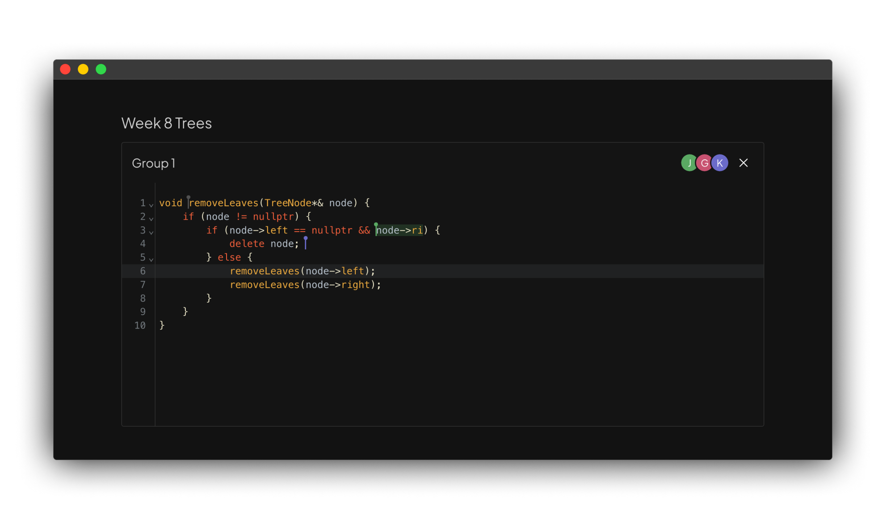

# `bcode`

`bcode` is a tool that enables Stanford section leaders to create collaborative small group problems during section. Hosts create **rooms** with one or more **groups** that students can join to collaboratively write code during section. Think of it like breakout rooms for code.

To start using `bcode` for your section, [sign in through GitHub](https://106b.vercel.app) and create a room! Once a room is created, you'll be able to share the link and QR code with your sectionees.

## Milestones

- [x] Add stricter authentication checks 🛡️
- [x] Add support for Python syntax highlighting (for CS106A) 🐍
- [x] Add support for starter code (avoid multiple copy/paste) 📜
- [x] Add support for locking rooms 🔒
